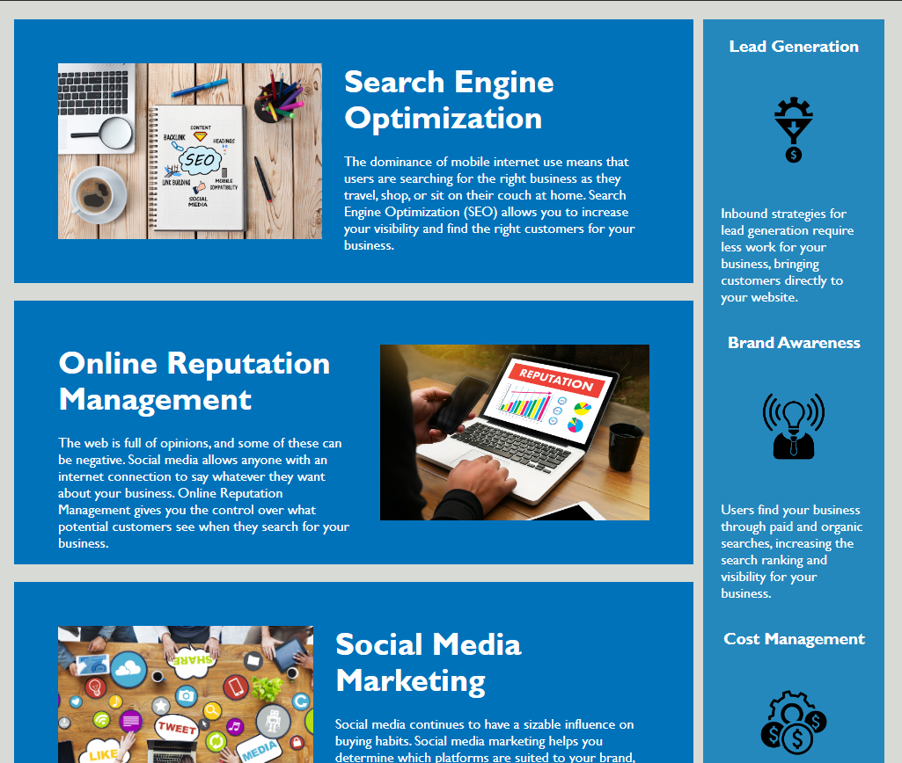

# module_1_challenge_new

Marketing site that was refactured to demonstrate symantec HTML elements and improve the Search engine optimization. 

The codebase follows accessibility standards and is optimized for search engines.

The website's index has incorporated symantic HTML tags and descriptive notations explaining where work was done.

The CSS page has been consolidated and is more legible for people to read and understand.

Overall functionality of links on the page have also been improved.

The webpage meets accessibility standards
WHEN you view the source code
THEN you find semantic HTML elements.

WHEN you view the structure of the HTML elements
THEN you find that the elements follow a logical structure independent of styling and positioning.

WHEN you view the image elements
THEN you find accessible alt attributes.

WHEN you view the heading attributes
THEN you fall in sequential order.

WHEN you view the title element
THEN you find a concise, descriptive title.

Link to website:
https://waltscode.github.io/module_1_challenge_new/ 

Screenshot of the site:

